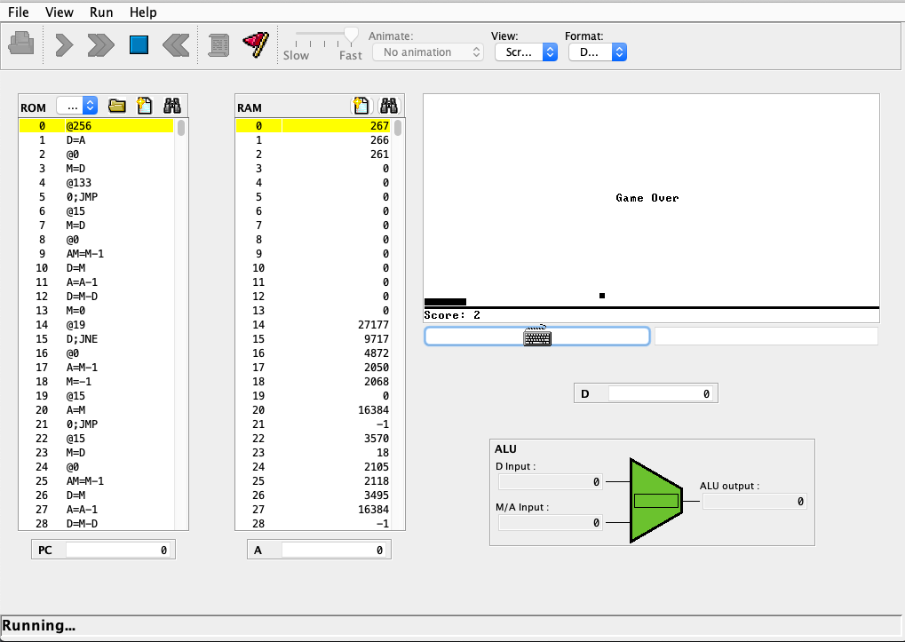

# Hack Computer System
### This is a series of projects to build a full functional computer, both hardware(using Hardware descriptive language also known as HDL) and software (using any language of your choice, except for Operating system, since it should be developed using the Jack language).
Those projects were inspired by the book:

**The Elements of Computing Systems: Building a Modern Computer from First Principles**

The book itself doesn't spply code or immediate solutions, instead it explains a principle, and then asks you to implement it yourself however you see fit.
I chose to implement the software projects in the **C programming language**, since that will allow me to implement all the data-structure required by those projects (such as hash-maps, trees, stacks, tries etc.) and thus, it goes along with the spirit of finishing a full computer from scratch.

### The projects are divided one per chapter as follows:

|The Chapter's challenge|Project|Status|
|----|-----|-------|
|chapter 1: Logic design|Building gates, Multiplexer, DeMultiplexer from NAND gates only |Completed using HDL|
|chapter 2: Arithmetic logic Unit|Build an ALU using the logic components from the previous chapter|Compeleted using HDL|
|chapter 3: Storage and RAM|Building 16K RAM using Flip Flops as the basic storage device |Completed using HDL|
|chapter 4: ASM language|Write programs in the Hack ASM langauge to utilise the ALU that was built in chapter 2  |Completed using Hack ASM language|
|chapter 5: Building a CPU|Building a full CPU by building a program counter (PC) and connecting them to registers, ROM and ALU to have a fully functional CPU|Completed using HDL|
|chapter 6: Assembler|Building a program to translate the Hack ASM to binary codes that can be executed by the CPU that was built in the previous chapter|Completed using the C language|
|chapter 7: Virtual Machine|Building program that can translate the Virtual Machine code (similar to java's bytecode) into hack ASM instructions |Completed using the C language|
|chapter 8: Virtual Machine II| Extending the Virtual Machine to handle multiple files, function calls and return statements|Completed using the C language|
|chapter 9: Jack Language|Building any basic program with the Jack programming language|Completed using the Jack programming language|
|chapter 10: Jack Compiler|Building a full compiler that can scan, tokenise, parse and generate VM code|Currently in progress using the C language|
|chapter 11: Jack Compiler II|Extending the Jack compiler|Currently in progress using the C language|
|chapter 12: Operating System|Building an Operating System for the Hack Computer (interacting with both, hardware and software) |Not implemented yet|

### The book did provide a full suite of tools for testing purposes (the photo below is using the CPU Emulator to test the pong game application)

